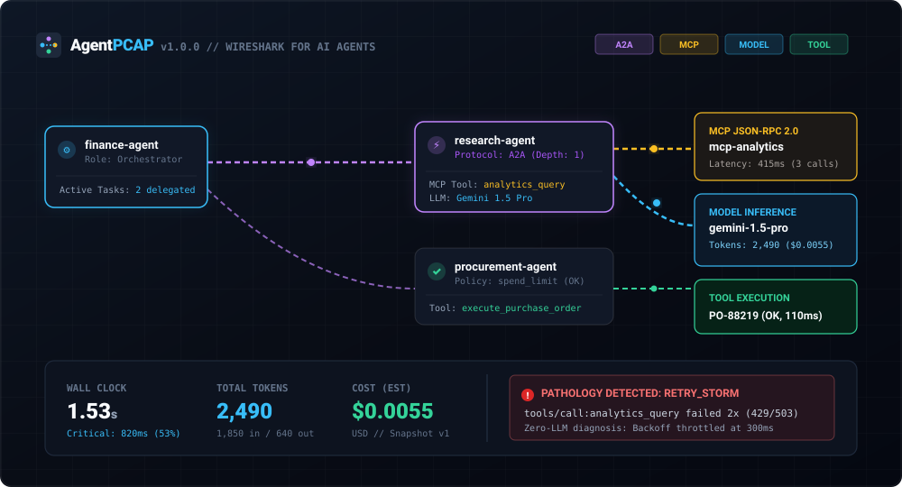
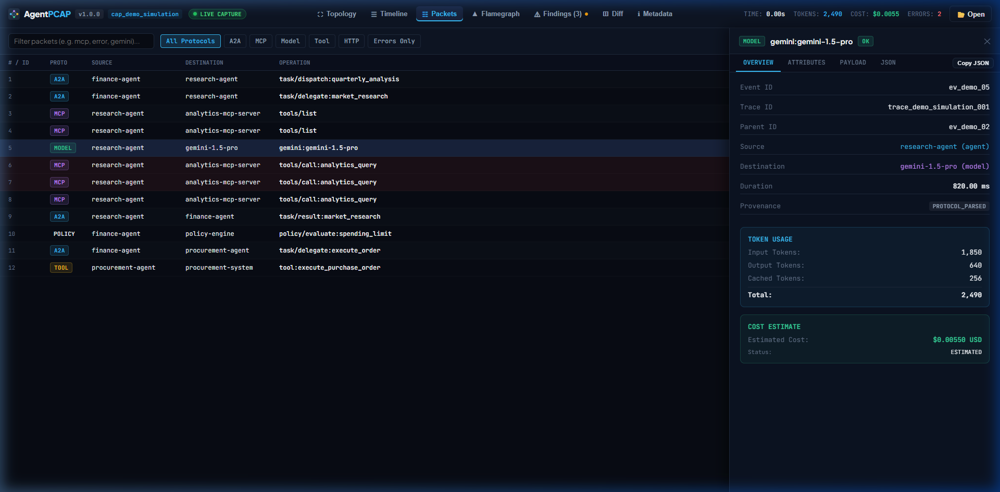
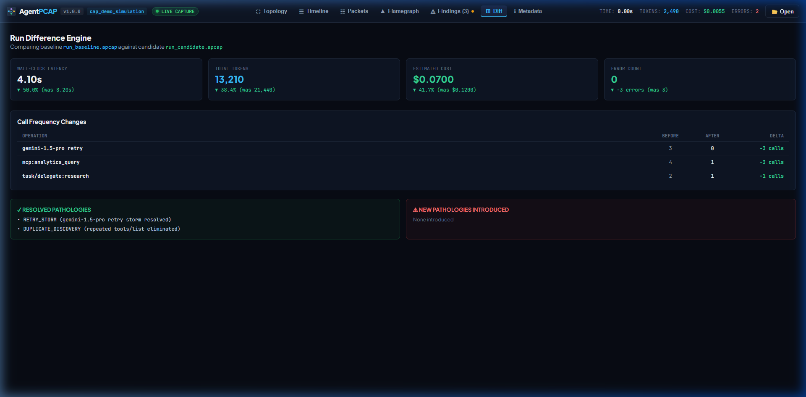
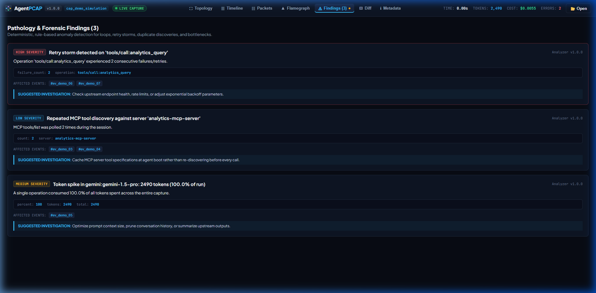

# AgentPCAP

### Wireshark for AI agents.

`agentpcap run -- ./my-agent`

Capture A2A, MCP, model and tool traffic in one local timeline.

No account. No API key. One Go binary.

[](CHANGELOG.md)
[](LICENSE)
[](https://go.dev/)

[Quickstart](#4-60-second-quickstart) • [Format Spec](spec/README.md) • [Protocol Support](#11-protocol-support) • [Docs](docs/ARCHITECTURE.md)

---

## 1. Hero

AgentPCAP is a local-first packet capture engine and interactive visual debugger designed specifically for multi-agent systems, Model Context Protocol (MCP) servers, Agent-to-Agent (A2A) tasks, and LLM APIs.



---

## 2. Demo Visual

See the entire concept in a single offline simulation:


---

## 3. Why AgentPCAP

When an autonomous agent system fails, hangs, or burns thousands of tokens, developers typically must stitch together disparate log streams across MCP servers, A2A tasks, model provider dashboards, and custom tool callbacks.

AgentPCAP eliminates this fragmentation:
- **Unified Capture**: Normalizes A2A, MCP, OpenAI, Gemini, Anthropic, and generic HTTP traffic into one coherent timeline.
- **Local & Offline**: Zero telemetry, no cloud accounts, no API keys, and no database daemons.
- **Protocol-Aware Inspection**: Deep decoding of JSON-RPC 2.0 frames, task delegation trees, and GenAI usage attributes.
- **Deterministic Explain**: Heuristic root-cause analysis that pinpoints retry storms and recursive loops without calling external LLMs.

---

## 4. 60-Second Quickstart

### Step 1: Run the Instant Multi-Agent Demo

Experience full protocol capture and pathology detection with zero setup:

```bash
agentpcap demo
```

Your default browser automatically opens to `http://127.0.0.1:9477`.

### Step 2: Capture Your Own Agent

Wrap your existing agent process directly:

```bash
# Capture Python, Node, Go, or compiled binaries
agentpcap run -- python agent.py
agentpcap run -- ./my-agent-binary
```

AgentPCAP sets up local proxy and OTLP listeners, injects standard environment variables (`HTTP_PROXY`, `OTEL_EXPORTER_OTLP_ENDPOINT`), executes your agent safely via native argument slices, and streams telemetry live.

---

## 5. Live Topology

Inspect your multi-agent architecture as a dynamic, directional graph. Watch live request pulses travel between orchestrator agents, sub-agents, MCP servers, and LLM backends:


---

## 6. Waterfall

Examine hierarchical parent-child delegation chains, track concurrent operations, and identify the exact critical path bottleneck dominating wall-clock latency:


---

## 7. Packet Inspector

Inspect every captured packet with Wireshark-style tabular clarity. View timestamps, protocol layers, endpoints, latencies, token consumption, and sanitized payloads:



---

## 8. Cost/Token Flamegraph

Visualize resource consumption across your agent network in four distinct views: `TIME`, `COST`, `TOKENS`, and `ERRORS`. Clearly see which agent or tool call consumed your budget:


---

## 9. Diff

Compare two agent runs side-by-side in your terminal or web viewer to immediately identify latency regressions, token drift, and new error conditions:

```bash
agentpcap diff baseline.apcap candidate.apcap
```

```text
AGENT RUN DIFF

                BEFORE      AFTER       DIFF
Latency           8.2s       4.1s     -50.0%
Model calls          8          5     -37.5%
Tool calls          12          7     -41.6%
Retries               3          0    -100.0%
Tokens             21k        13k     -38.1%

CHANGED
- Gemini retry ×3
+ Gemini retry ×0
- MCP tools/list ×4
+ MCP tools/list ×1
```



---

## 10. Explain

Diagnose performance bottlenecks and execution pathologies offline **without calling an external LLM**:

```bash
agentpcap explain run.apcap
```

```text
LIKELY BOTTLENECK
Gemini request #3 accounted for 72% of wall-clock time.

CAUSE CHAIN
finance-agent
└─ research-agent
   └─ analytics MCP
      └─ model retry ×3

OBSERVATIONS
• Three equivalent model attempts observed
• Retries added 4.8s to critical path
• MCP server latency was negligible (<12ms)

SUGGESTED INVESTIGATION
Review research-agent retry backoff policy on 429 rate limit responses.
```



---

## 11. Protocol Support

AgentPCAP provides native protocol decoding for verified specifications:

| Protocol | Specification Version | Capture Mode | Decode | Streaming | Status |
| :--- | :--- | :--- | :---: | :---: | :---: |
| **MCP** | 2024-11-05 & current | Proxy / stdio | Yes | Yes | Supported |
| **A2A** | v0.1 & current drafts | Proxy / SDK | Yes | Yes | Supported |
| **OTLP / HTTP** | OpenTelemetry GenAI semconv | OTLP Ingest (`/v1/traces`) | Yes | Yes | Supported |
| **Google Gemini** | Generative Language REST | Reverse / Forward Proxy | Yes | Yes | Supported |
| **OpenAI** | `/v1/chat/completions` | Reverse / Forward Proxy | Yes | Yes | Supported |
| **Anthropic** | `/v1/messages` | Reverse / Forward Proxy | Yes | Yes | Supported |

---

## 12. `.apcap`

All captures are stored in the standardized `.apcap` format—an open, containerized ZIP archive:

```text
capture.apcap (ZIP container)
├── manifest.json       # Capture metadata, SHA-256 hashes, protocol index
├── metadata.json       # High-level aggregate metrics (tokens, costs, errors)
├── events.jsonl        # Line-delimited canonical event stream
└── attachments/        # Optional sanitized payloads and forensic artifacts
```

- Complete Specification: [`spec/README.md`](spec/README.md)
- JSON Schema: [`spec/apcap.schema.json`](spec/apcap.schema.json)
- Canonical Test Vectors: [`spec/vectors/`](spec/vectors/)

---

## 13. Privacy

AgentPCAP is engineered for privacy and security:

- **Local by Default**: Captures remain strictly on your local machine. Zero telemetry, zero cloud tracking, zero phone-home behavior.
- **Metadata-Only by Default**: Raw prompts, completions, and tool arguments are never persisted unless `--capture-content` is explicitly set.
- **Centralized Redaction**: Automated scrubbing engine strips Google AI keys (`AIza*`), OpenAI keys (`sk-*`), Anthropic keys (`sk-ant-*`), GitHub tokens, JWTs, and Bearer authorization headers.
- **Loopback Binding**: Listeners bind strictly to `127.0.0.1` by default.

See [docs/PRIVACY.md](docs/PRIVACY.md) and [docs/SECURITY.md](docs/SECURITY.md) for full details.

---

## 14. Architecture

AgentPCAP executes as a single compiled Go binary embedding a high-performance React + TypeScript web viewer:

```text
               Target Agent Process (Python, Node, Go, Binary)
                                    │
                        ┌───────────┴───────────┐
                        │   Capture Subsystem   │
                        │ (Proxy, OTLP, Runner) │
                        └───────────┬───────────┘
                                    │
                         Protocol Normalization
                        (A2A, MCP, Models, Tools)
                                    │
                        ┌───────────┴───────────┐
                        │     Session Engine    │
                        │ (In-Memory / Ringbuf) │
                        └───────────┬───────────┘
                                    │
                 ┌──────────────────┼──────────────────┐
                 ▼                                     ▼
        ┌─────────────────┐                   ┌─────────────────┐
        │  .apcap Stream  │                   │ Embedded Server │
        │ (ZIP Container) │                   │  (SSE + REST)   │
        └────────┬────────┘                   └────────┬────────┘
                 │                                     │
      ┌──────────┴──────────┐                          ▼
      ▼                     ▼                 ┌─────────────────┐
CLI Tools               CI Check              │ React Viewer UI │
(explain, diff, top)  (Quality Gates)         │(Topology, Flame)│
                                              └─────────────────┘
```

See [docs/ARCHITECTURE.md](docs/ARCHITECTURE.md) for deep-dive technical design documents.

---

## 15. Installation

### Pre-Built Binaries

Download the standalone executable for your operating system from [GitHub Releases](https://github.com/agentpcap/agentpcap/releases):

- Linux (`amd64`, `arm64`)
- macOS (`arm64`, `amd64`)
- Windows (`amd64`)

Verify the cryptographic SHA-256 hash:

```bash
sha256sum -c checksums.txt
```

### Install via Go

```bash
go install github.com/agentpcap/agentpcap/cmd/agentpcap@v1.0.0
```

### Build from Source

```bash
git clone https://github.com/agentpcap/agentpcap.git
cd agentpcap
make web
make build
./agentpcap doctor
```

---

## 16. CI

Integrate AgentPCAP into continuous integration pipelines to assert budget and reliability gates:

```bash
# Assert thresholds defined in .agentpcap.yml
agentpcap check run.apcap
```

Sample `.agentpcap.yml`:

```yaml
version: "1"
assertions:
  max_duration_seconds: 15.0
  max_total_tokens: 50000
  max_estimated_cost_usd: 0.25
  disallow_pathologies:
    - RETRY_STORM
    - AGENT_LOOP
```

See [docs/CI.md](docs/CI.md) for GitHub Actions and GitLab CI integration templates.

---

## 17. Known Limitations

To maintain clear technical boundaries, AgentPCAP explicitly documents non-goals:

- **No Transparent Encrypted TLS Decryption**: Target applications must accept standard `HTTP_PROXY`/`HTTPS_PROXY` environment variables, point base URLs to local ports, export OTLP, or use `pkg/sdk`.
- **Static Pricing Catalog**: Token costs are estimated from embedded pricing snapshots unless reported directly by provider response metadata.
- **In-Memory Ring Buffer**: Ultra-large captures (>250,000 events) should stream directly to disk using `--output` and be inspected offline.

See [docs/KNOWN_LIMITATIONS.md](docs/KNOWN_LIMITATIONS.md) and [docs/V1_SCOPE.md](docs/V1_SCOPE.md).

---

## 18. Contributing

Contributions are welcome across protocol adapters, analyzer rules, and documentation.

```bash
# Run unit tests
go test -v ./...

# Run race condition checks
go test -race ./...

# Run protocol torture suite
go test -v ./tests/torture
```

See [CONTRIBUTING.md](CONTRIBUTING.md) for contribution guidelines.

---

## 19. License

AgentPCAP is open source licensed under the [Apache License, Version 2.0](LICENSE).
The `.apcap` specification is open and royalty-free.
